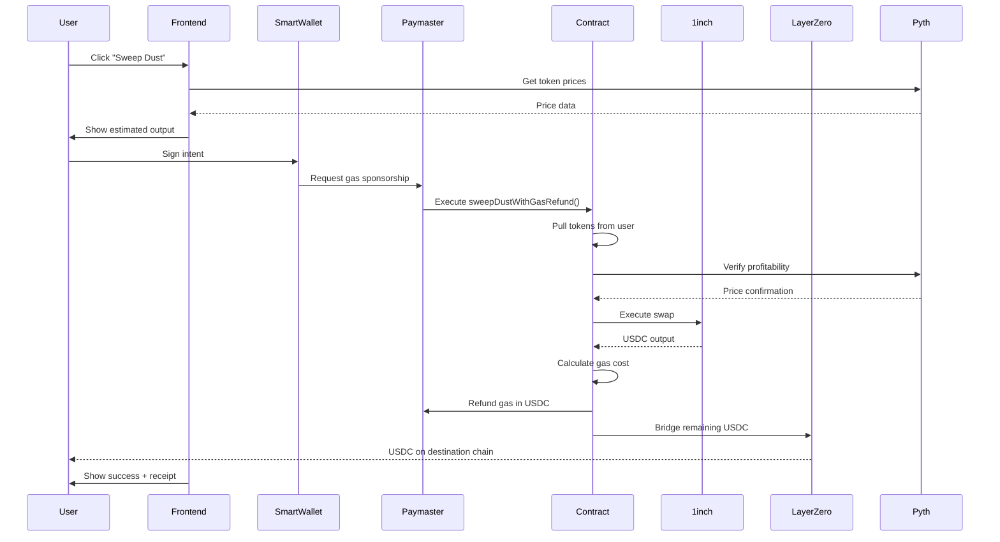

# 🏗️ OmniSweep Architecture

## Overview

OmniSweep is built on a hybrid architecture that combines the simplicity of atomic smart contracts with the sophistication of intent-based transaction flows and gas abstraction.

## Core Components

### 1. Smart Contracts

#### OmniSweepCore.sol
The main contract that orchestrates the dust sweeping process.

```solidity
contract OmniSweepCore {
    function sweepDustWithGasRefund(
        address[] tokens,
        uint256[] amounts,
        address outputToken,
        uint256 minOutputAmount,
        address destinationChain,
        bytes calldata worldIdProof
    ) external returns (uint256 netOutput);
}
```

**Key Functions:**
- `sweepDustWithGasRefund()` - Main entry point for dust sweeping
- `calculateGasCost()` - Estimates transaction gas cost
- `verifyProfitability()` - Uses Pyth to ensure tx is profitable
- `executeSwap()` - Calls 1inch for optimal routing
- `bridgeTokens()` - Initiates LayerZero cross-chain transfer

#### Components:
1. **Token Aggregator** - Collects multiple tokens in one tx
2. **DEX Router** - Interfaces with 1inch aggregator
3. **Price Oracle** - Pyth Network integration
4. **Bridge Adapter** - LayerZero messaging
5. **Paymaster Logic** - Gas advance and refund mechanism

### 2. Gas Advance Protocol

The "secret sauce" that makes gasless sweeping possible.

#### How It Works:

```
1. User signs intent (no gas needed)
2. Paymaster sponsors transaction
3. Contract executes swap
4. Contract calculates: gasCost = tx.gasprice * gasUsed
5. Contract deducts gasCost from swapped USDC
6. Contract refunds Paymaster
7. User receives: swappedAmount - gasCost - protocolFee
```

#### Safety Mechanism:

```solidity
// Before execution
uint256 estimatedValue = pythPrice * tokenAmount;
uint256 estimatedGas = gasPrice * gasLimit;

require(estimatedValue > estimatedGas * 1.2, "Unprofitable transaction");
```

**The 1.2x multiplier ensures:**
- Gas estimation errors don't make tx unprofitable
- Protocol fee (0.5%) is covered
- User gets net positive value

### 3. Frontend Architecture

```
┌────────────────────────────────────────┐
│           React Frontend               │
├────────────────────────────────────────┤
│  ┌──────────────────────────────────┐  │
│  │   Wallet Connection Layer        │  │
│  │  (Coinbase Smart Wallet SDK)     │  │
│  └──────────────────────────────────┘  │
│                                        │
│  ┌──────────────────────────────────┐  │
│  │   Balance Scanner                │  │
│  │  - Multi-chain RPC calls         │  │
│  │  - Token detection               │  │
│  │  - Dust filtering (<$10)         │  │
│  └──────────────────────────────────┘  │
│                                        │
│  ┌──────────────────────────────────┐  │
│  │   Price Aggregator               │  │
│  │  - Pyth API integration          │  │
│  │  - USD value calculation         │  │
│  │  - Gas estimation                │  │
│  └──────────────────────────────────┘  │
│                                        │
│  ┌──────────────────────────────────┐  │
│  │   Intent Builder                 │  │
│  │  - ERC-4337 UserOp construction  │  │
│  │  - Batch call encoding           │  │
│  │  - Signature request             │  │
│  └──────────────────────────────────┘  │
│                                        │
│  ┌──────────────────────────────────┐  │
│  │   Transaction Monitor            │  │
│  │  - Status tracking               │  │
│  │  - Receipt display               │  │
│  │  - Error handling                │  │
│  └──────────────────────────────────┘  │
└────────────────────────────────────────┘
```

### 4. Data Flow

#### Sweep Transaction Flow:



## Technical Decisions

### Why This Architecture?

#### 1. **Atomic Smart Contracts Over Relayers**
**Decision:** Use smart contracts for core logic, not off-chain relayers

**Rationale:**
- ✅ Deterministic execution
- ✅ No server dependencies
- ✅ Lower technical risk
- ✅ Better for hackathon (less infrastructure)
- ❌ Relayers introduce: nonce management, reorg handling, server uptime risks

#### 2. **1inch Over Uniswap V4**
**Decision:** Use 1inch API for swaps

**Rationale:**
- ✅ Aggregates ALL DEXs (Uniswap, Balancer, Curve, etc.)
- ✅ Best prices automatically
- ✅ Battle-tested API
- ✅ Easy to implement
- ❌ Uniswap V4 is too new/complex for 36h hackathon

#### 3. **Pyth Over Chainlink**
**Decision:** Use Pyth Network for price feeds

**Rationale:**
- ✅ Sub-second price updates
- ✅ Better for profitability checks
- ✅ Sponsor prize opportunity
- ✅ Cross-chain native
- ✅ Lower latency

#### 4. **LayerZero Over Native Bridges**
**Decision:** Use LayerZero for cross-chain messaging

**Rationale:**
- ✅ Unified API across chains
- ✅ Security via multiple verifiers
- ✅ Faster than most bridges
- ✅ Sponsor integration
- ❌ Native bridges are chain-specific and slower

#### 5. **Coinbase Smart Wallet Over EOA**
**Decision:** Require Coinbase Smart Wallet

**Rationale:**
- ✅ Built-in paymaster support
- ✅ Batch transactions
- ✅ Better UX (no gas management)
- ✅ Sponsor prize opportunity
- ✅ Future-proof (ERC-4337 standard)

### What We Cut (From Initial Plan)

#### ❌ Filecoin Storage
**Why:** Storing transaction receipts on IPFS adds latency and complexity. Nobody needs permanent storage of a $5 dust sweep receipt.

#### ❌ Custom Relayer Backend
**Why:** Too high risk for hackathon. If server crashes, demo dies. Smart contracts are deterministic and reliable.

#### ❌ Multi-Signature Complexity
**Why:** Coinbase Smart Wallet handles signature aggregation. Don't reinvent the wheel.

## Security Considerations

### 1. Price Oracle Manipulation
**Risk:** Attacker manipulates Pyth price feed to make unprofitable tx appear profitable

**Mitigation:**
- Use Pyth's exponentially-weighted moving average (EMA) prices
- Require minimum confidence intervals
- Add 20% safety buffer to profitability checks
- Implement price staleness checks

### 2. Reentrancy Attacks
**Risk:** Malicious token contract reenters during sweep

**Mitigation:**
- Use OpenZeppelin's ReentrancyGuard
- Checks-Effects-Interactions pattern
- Trusted token whitelist for MVP

### 3. Gas Griefing
**Risk:** User creates tx that consumes excessive gas to drain paymaster

**Mitigation:**
- Fixed gas limits per operation
- Paymaster approval of UserOps
- Token whitelist (no malicious contracts)

### 4. Front-Running
**Risk:** MEV bot sees profitable sweep and front-runs it

**Mitigation:**
- Use Flashbots RPC for private mempool
- Add deadline parameter to swaps
- Implement slippage protection

## Performance Optimization

### 1. Batch Processing
- Aggregate multiple token approvals in single tx
- Use multicall for parallel operations
- Reduce number of state writes

### 2. Gas Optimization
```solidity
// Use unchecked math where overflow is impossible
unchecked {
    totalValue += values[i]; // i is bounded by array length
}

// Pack structs efficiently
struct SweepParams {
    address token;      // 20 bytes
    uint96 amount;      // 12 bytes (max 79B tokens)
    uint32 chainId;     // 4 bytes
    // Total: 36 bytes (fits in 2 slots)
}
```

### 3. Off-Chain Computation
- Calculate optimal routes off-chain
- Only verify on-chain
- Use view functions for simulations

## Scalability

### Current Limitations (MVP)
- 5 tokens max per sweep
- 2 chains (Optimism → Base)
- USDC output only
- Manual trigger

### Future Improvements
- Support 20+ tokens per sweep
- 10+ chains
- Multiple output tokens (ETH, USDC, DAI)
- Automatic recurring sweeps (weekly)
- Advanced routing (multi-hop swaps)

## Testing Strategy

### Unit Tests
- `sweepDustWithGasRefund()` - Core logic
- `calculateGasCost()` - Gas estimation accuracy
- `verifyProfitability()` - Pyth price checks
- Edge cases: zero amounts, single token, max tokens

### Integration Tests
- Full sweep flow (E2E)
- 1inch integration
- LayerZero messaging
- Paymaster gas refund

### Mainnet Fork Tests
- Test against real DEX liquidity
- Real Pyth price feeds
- Actual gas costs on various chains

## Monitoring & Observability

### Key Metrics
1. **Success Rate** - % of sweeps that complete
2. **Average Net Output** - Typical user profit
3. **Gas Efficiency** - Gas used vs estimated
4. **Swap Slippage** - 1inch execution quality
5. **Bridge Time** - LayerZero latency

### Events
```solidity
event SweepExecuted(
    address indexed user,
    uint256 inputValue,
    uint256 outputValue,
    uint256 gasCost,
    uint256 protocolFee
);

event UnprofitableSweepReverted(
    address indexed user,
    uint256 estimatedValue,
    uint256 estimatedGas
);
```

## Deployment Strategy

### Testnet Deployment
1. Deploy to Base Sepolia
2. Deploy to Optimism Sepolia
3. Fund test paymaster
4. Configure Pyth price feeds
5. Whitelist test tokens

### Mainnet Deployment
1. Audit smart contracts
2. Deploy to Base mainnet
3. Deploy to Optimism mainnet
4. Configure production paymasters
5. Set conservative gas limits
6. Enable monitoring/alerts
7. Gradual rollout (whitelist beta users)

---

**Architecture Status:** ✅ Finalized for MVP
**Last Updated:** November 2024
**Next Review:** Post-Hackathon
